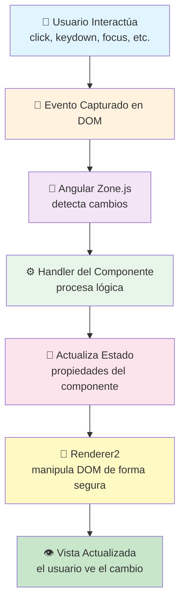

# 🗺️ MapMyJourney

## 📖 Descripción del Proyecto

**MapMyJourney** es una aplicación web colaborativa diseñada para planificar viajes, gestionar gastos compartidos y registrar las experiencias de grupo. Combinamos un **backend robusto en Spring Boot** con un **frontend moderno en Angular** para crear una experiencia completa de gestión de viajes.

### ✨ Características Principales

- **Planificación de Viajes**: Crea y organiza viajes colaborativos
- **Gestión de Gastos**: Registra gastos compartidos y calcula quién debe pagar a quién
- **Autenticación Segura**: JWT con tokens de 24 horas y encriptación BCrypt
- **API REST**: 40+ endpoints documentados con OpenAPI/Swagger
- **Base de Datos Relacional**: Diseño optimizado con H2/SQL
- **Interfaz Intuitiva**: Componentes Angular con arquitectura modular
- **Documentación Automática**: Javadoc HTML y PDF generados con GitHub Actions

---

## 📚 Documentación Importante

### 🔗 Enlaces a Documentación

| Sección | Descripción | Enlace |
|---------|-------------|--------|
| **GitHub Pages** | Sitio web completo desplegado en GitHub Pages | [MapMyJourney Live](https://guntermagno.github.io/MapMyJourney/demo) |
| **Backend API** | Documentación completa de endpoints y arquitectura | [Backend Docs](/docs/backend/Documentacion.md) |
| **Diseño & CSS** | Arquitectura visual y sistema de diseño | [Guía de Diseño](/docs/design/DOCUMENTACION.md) |
| **Javadoc API** | Documentación automática del código Java | [API Documentation](https://guntermagno.github.io/MapMyJourney/api-docs) |
| **Deploy & CI/CD** | Guía de despliegue y GitHub Actions | [Deploy Guide](/docs/deploy/deploy-instructions.md) |
| **Base de Datos** | Diagrama ER y modelo de datos | [Database Docs](/docs/backend/) |

---

## 🛠️ Stack Tecnológico


### Backend
- **Framework**: Spring Boot 3.5.6
- **Lenguaje**: Java 21
- **Base de Datos**: H2 Database
- **Autenticación**: JWT + Spring Security
- **ORM**: JPA/Hibernate
- **Build**: Maven
- **Testing**: JUnit 5, MockMvc

### Frontend
- **Framework**: Angular (Latest)
- **Lenguaje**: TypeScript
- **Estilos**: SCSS
- **Arquitectura**: Componentes Modulares
- **Routing**: Angular Router con SSR

### DevOps
- **CI/CD**: GitHub Actions
- **Documentación**: Javadoc (HTML + PDF)
- **Hosting**: GitHub Pages
- **Control de Versiones**: Git

---

## 🚀 Inicio Rápido

### Requisitos Previos
- Java 21 (Temurin)
- Maven 3.8+
- Node.js 18+ (para frontend)
- Git

### Instalación Backend
```bash
cd backend
mvn clean install
mvn spring-boot:run
```

### Instalación Frontend
```bash
cd frontend
npm install
npm start
```

---

## Arquitectura de Eventos

### Introducción

En MapMyJourney implementamos una arquitectura de eventos basada en los principios de Angular que asegura la separación clara entre la lógica de negocio y la manipulación del DOM. Este enfoque garantiza código más mantenible, testeable y accesible.

### Flujo Unidireccional de Eventos

El flujo de eventos en nuestra aplicación sigue un patrón estricto:

1. **Captura**: El usuario interactúa con el DOM (click, tecla, foco, etc.)
2. **Delegación Angular**: Angular captura el evento mediante Zone.js
3. **Handler Vinculado**: El método handler en el componente procesa el evento
4. **Actualización de Estado**: Se modifica el estado del componente
5. **Cambio de Vista**: Renderer2 actualiza el DOM de forma segura

Este flujo unidireccional evita comportamientos impredecibles y facilita la depuración.

### Event Binding en Templates vs onclick

Utilizamos exclusivamente `(evento)="handler()"` en los templates en lugar de atributos `onclick`. Las razones son:

- **Seguridad**: Angular sanitiza eventos y previene inyecciones XSS
- **Detección de Cambios**: Angular Zone.js sincroniza automáticamente el estado con la vista
- **Accesibilidad**: Los eventos vinculados funcionan con navegación por teclado
- **Testing**: Los eventos vinculados son más fáciles de mockear en pruebas unitarias
- **Compilación**: El compilador de Angular verifica tipos en los handlers
- **SSR**: El event binding es compatible con Server-Side Rendering

En contraste, `onclick` es un atributo HTML plano que no goza de estas ventajas y puede causar comportamientos inesperados en aplicaciones SPA.

### Renderer2 vs Acceso Directo al DOM

El proyecto implementa Renderer2 como el mecanismo principal para cualquier manipulación del DOM programática. Esto es crítico porque:

**Prohibido (Acceso directo)**:
```typescript
// ❌ NO HACER ESTO
document.getElementById('modal').style.display = 'none';
element.nativeElement.innerHTML = 'Texto';
document.querySelector('.btn').classList.add('active');
```

**Correcto (Renderer2)**:
```typescript
// ✅ HACER ESTO
this.renderer.setStyle(element, 'display', 'none');
this.renderer.setProperty(element, 'textContent', 'Texto');
this.renderer.addClass(element, 'active');
```

Las ventajas de Renderer2 son:

- **Compatibilidad SSR**: Funciona en plataforma del servidor sin errores
- **Seguridad**: Evita inyecciones de código malicioso
- **Abstracción**: Desvincula la lógica de la implementación del navegador
- **Testabilidad**: Permite mockear Renderer2 en pruebas

### @HostListener: Escucha de Eventos Globales

Para eventos que afectan al componente desde niveles superiores, usamos `@HostListener`:

```typescript
@HostListener('document:click', ['$event'])
onDocumentClick(event: MouseEvent) {
  // Cierra el menú si el click es fuera
}

@HostListener('window:resize')
onResize() {
  // Adapta el layout responsive
}

@HostListener('keydown.escape')
onEscape() {
  // Cierra modales y popups
}
```

`@HostListener` permite:
- Escuchar eventos en elementos globales (document, window)
- Usar modifiers de Angular para filtrar teclas específicas
- Mantener la lógica dentro del componente sin contaminar el template
- Registrar y desregistrar listeners automáticamente (memoria limpia)

### Gestor de Eventos: @ViewChild y @ContentChildren

Para acceder a elementos y componentes hijos de forma segura:

```typescript
@ViewChild('modalContent', { static: false }) modalRef: ElementRef;
@ContentChildren(AccordionItemComponent) items: QueryList<AccordionItemComponent>;

ngAfterViewInit() {
  // Aquí los ViewChild están disponibles
  this.renderer.setAttribute(this.modalRef.nativeElement, 'aria-modal', 'true');
}
```

El descriptor `{ static: false }` es obligatorio si accedes en `ngAfterViewInit()`, que es el ciclo correcto para manipular el DOM.

### Conclusión

Esta arquitectura de eventos garantiza que MapMyJourney sea:
- **Seguro**: Sin inyecciones XSS
- **Accesible**: Compatible con navegación por teclado
- **Mantenible**: Código predecible y testeable
- **Performante**: Detección de cambios eficiente
- **Compatible**: SSR, AOT, todos los navegadores

---

### Diagrama de Flujo de Eventos



---

### Tabla de Compatibilidad de Eventos

| Evento | Chrome | Firefox | Safari | Edge | Descripción |
|--------|--------|---------|--------|------|-------------|
| click | 1+ | 1+ | 1+ | 12+ | Clic del ratón en elemento |
| dblclick | 1+ | 1+ | 1+ | 12+ | Doble clic del ratón |
| mouseenter | 30+ | 10+ | 13.1+ | 12+ | Ratón entra en elemento (sin burbuja) |
| mouseleave | 30+ | 10+ | 13.1+ | 12+ | Ratón sale del elemento (sin burbuja) |
| mouseover | 1+ | 1+ | 1+ | 12+ | Ratón entra en elemento (con burbuja) |
| mouseout | 1+ | 1+ | 1+ | 12+ | Ratón sale del elemento (con burbuja) |
| keydown | 1+ | 1+ | 1+ | 12+ | Tecla presionada (inicio) |
| keyup | 1+ | 1+ | 1+ | 12+ | Tecla liberada (fin) |
| keypress | 1+ | 1+ | 1+ | 12+ | Carácter insertado (deprecated) |
| focus | 1+ | 1+ | 1+ | 12+ | Elemento recibe foco (sin burbuja) |
| blur | 1+ | 1+ | 1+ | 12+ | Elemento pierde foco (sin burbuja) |
| focusin | 1+ | 3.6+ | 1+ | 12+ | Elemento recibe foco (con burbuja) |
| focusout | 1+ | 3.6+ | 1+ | 12+ | Elemento pierde foco (con burbuja) |
| change | 1+ | 1+ | 1+ | 12+ | Valor de input cambia |
| input | 1+ | 1+ | 3.1+ | 12+ | Valor de input se modifica en tiempo real |
| submit | 1+ | 1+ | 1+ | 12+ | Formulario enviado |
| reset | 1+ | 1+ | 1+ | 12+ | Formulario reiniciado |
| resize | 1+ | 1+ | 1+ | 12+ | Ventana/elemento redimensionado |
| scroll | 1+ | 1+ | 1+ | 12+ | Elemento se desplaza (puede causar perf issues) |

**Notas:**
- Todos los navegadores modernos (últimas 3 versiones) soportan estos eventos
- Para navegadores antiguos (<IE 11), considere polyfills (no recomendado en 2026)
- Los eventos indicados con "sin burbuja" no se propagan a elementos padre
- Angular abstrae estas diferencias a través de Renderer2

---

## 📊 Estado del Proyecto

## Estado de los tests

### ✅ - Test Correctos## 👥 Contribuciones

Para contribuir al proyecto, por favor:
1. Fork el repositorio
2. Crea una rama para tu feature (`git checkout -b feature/AmazingFeature`)
3. Commit tus cambios (`git commit -m 'Add some AmazingFeature'`)
4. Push a la rama (`git push origin feature/AmazingFeature`)
5. Abre un Pull Request
