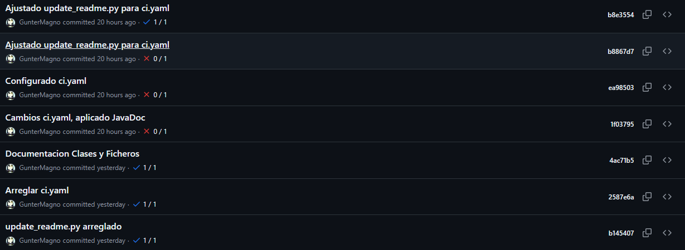

## Estado de los tests

### ✅ - Test Correctos

# Práctica 1.1: GH Action para Documentación — *MapMyJourney*

- **Lenguaje utilizado:** `Java` (Spring Boot – Backend del proyecto `MapMyJourney`)  
- **Herramienta de documentación:** `Javadoc`  
- **Formatos generados:** `HTML` y `PDF`  
- **Herramienta de CI/CD:** `GitHub Actions`  

## a) Herramientas usadas y comandos ejecutados

- **Java 21 (Temurin)**  

  Utilizado como JDK principal para compilar y generar documentación.

- **Maven**  

  Sistema de construcción y dependencias utilizado para compilar y ejecutar tareas como:
  ```bash
  mvn clean javadoc:javadoc
  ```

- **Javadoc** 

  Genera la documentación HTML a partir de los comentarios del código fuente en backend/src/main/java.

- **wkhtmltopdf**

    Convierte automáticamente todos los archivos HTML generados por Javadoc en PDFs, manteniendo la misma estructura de carpetas:

    ```bash
    sudo apt-get update && sudo apt-get install -y wkhtmltopdf
    for html in $(find target/site/apidocs -type f -name "*.html"); do
    relative_path=$(realpath --relative-to=target/site/apidocs "$html")
    pdf_path="target/reports/pdf/${relative_path%.html}.pdf"
    mkdir -p "$(dirname "$pdf_path")"
    wkhtmltopdf --enable-local-file-access "file://$(pwd)/$html" "$pdf_path"
    done
    ```

- **GitHub Actions**

  Automatiza el proceso de generación, commit y despliegue de la documentación.

---

## b) Ejemplo de código documentado

**Clase:** [`Viaje.java`](https://github.com/GunterMagno/MapMyJourney/blob/main/backend/src/main/java/com/mapmyjourney/backend/model/Viaje.java)

**Fragmento documentado:**

```java
/**
 * Representa un viaje con un título asociado.
 * <p>
 * La clase permite comprobar si un título de viaje es válido,
 * es decir, si no está vacío y no supera los 30 caracteres.
 */
public class Viaje {

    /**
     * Título del viaje.
     * Inicializa con un valor por defecto: "Viaje a Benidorm".
     */
    public String titulo = "Viaje a Benidorm";

    /**
     * Constructor de la clase Viaje.
     *
     * @param titulo El título del viaje que se asignará al objeto.
     */
    public Viaje(String titulo) {
        this.titulo = titulo;
    }

    /**
     * Comprobar si el título del viaje es válido.
     * <p>
     * Un título es válido si no está vacío y no excede los 30 caracteres.
     *
     * @param titulo El título a comprobar.
     * @return {@code true} si el título es válido, {@code false} en caso contrario.
     */
    public boolean comprobarNombre(String titulo) {
        return !titulo.isEmpty() && titulo.length() <= 30;
    }
}
```

**Estilo:** - 
- ``/** ... */`` → Comentario de documentación JavaDoc.

- ``@param`` → Describe los parámetros de un método.

- ``@return`` → Describe lo que devuelve un método.

---

## c) Formatos generados (HTML + PDF)

Se generan dos formatos:

* 📘 **HTML:** generado directamente por Javadoc en
  [`/docs`](https://github.com/GunterMagno/MapMyJourney/tree/main/docs)

* 📙 **PDF:** generado a partir de los HTML mediante `wkhtmltopdf` y `pdfunite`, disponible en
  [`/docs/pdf`](https://github.com/GunterMagno/MapMyJourney/tree/main/docs/pdf)

Además, el workflow despliega la documentación HTML automáticamente en GitHub Pages:

👉 [Documentación publicada en GitHub Pages](https://guntermagno.github.io/MapMyJourney)

---

## d) Explicación del workflow

El workflow **“CI con AutoCommit y Documentación”** automatiza todo el proceso de integración continua, pruebas, documentación y despliegue del proyecto en GitHub Pages.  
Se ejecuta automáticamente cada vez que se hace un `push` a la rama `main`, o manualmente mediante `workflow_dispatch`.

### 🔄 Descripción paso a paso:

1. **Checkout del repositorio**  
   Usa `actions/checkout@v4` para clonar el contenido del repositorio en el entorno de ejecución del runner.

2. **Configuración del entorno Java 21 (Temurin)**  
   Mediante `actions/setup-java@v5` se instala y configura el JDK 21 necesario para compilar y generar la documentación Javadoc.

3. **Instalación de Maven**  
   Se instala la herramienta `maven` desde los repositorios de Ubuntu, utilizada para ejecutar tests y generar la documentación.

4. **Configuración de Python 3.10**  
   Usa `actions/setup-python@v4` para permitir la ejecución del script `update_readme.py`, que actualiza el estado del README.md y report.md.

5. **Ejecución de tests automáticos**  
   Con `mvn test`, se ejecutan las pruebas unitarias del backend, y genera el informe `report.md` en la carpeta de `backend`.

6. **Actualización de README.md y report.md**  
   Se ejecuta el script Python `update_readme.py`, que inserta dinámicamente el estado de los tests en el `README.md`.

7. **Generación del Javadoc en formato HTML**  
   Se ejecuta `mvn clean javadoc:javadoc` para generar la documentación del código Java en `backend/target/site/apidocs`.

8. **Instalación de wkhtmltopdf**  
   Se instala la herramienta `wkhtmltopdf`, que permitirá convertir los archivos HTML generados por Javadoc en PDFs.

9. **Conversión de los HTML a PDFs individuales**  
   Recorre todos los `.html` dentro de `target/site/apidocs` y genera una copia en formato PDF dentro de `target/reports/pdf`, manteniendo la estructura de carpetas.

10. Copia de documentación a `/docs`
    Se eliminan los contenidos antiguos y se copian los nuevos HTML y PDFs generados a la carpeta /docs.

11. Commit automático del README.md, report.md y documentación
    El workflow configura Git, añade los cambios y realiza un commit automático con el mensaje:
     `Update README.md, report.md y documentación Javadoc`
    . Si no hay cambios, el commit se omite automáticamente.

12. Despliegue en GitHub Pages
    Finalmente, con Cecilapp/GitHub-Pages-deploy@v3, se publica la carpeta /docs en la rama gh-pages, actualizando la documentación accesible desde:

    https://guntermagno.github.io/MapMyJourney

---

## e) Mensajes de commit (evidencias)



---

## f) Evidencia SSH y seguridad

Configuré una clave SSH local y la asocié a mi cuenta de GitHub.

Prueba de conexión:


Los workflows usan `secrets.GITHUB_TOKEN`, garantizando autenticación segura en las acciones automatizadas sin exponer claves personales.

---

## g) Cómo clonar y usar el repositorio

Para generar documentación localmente:

```bash
git clone git@github.com:GunterMagno/MapMyJourney.git
cd MapMyJourney/backend
mvn clean javadoc:javadoc
```

Esto genera la documentación en:

```
backend/target/site/apidocs
```

Para generar también los PDFs, simplemente haz push a `main` o ejecuta el workflow manualmente desde GitHub Actions (`workflow_dispatch`).

Los resultados se almacenan automáticamente en `/docs` y se publican en GitHub Pages.

---

## RESPUESTAS AL CUESTIONARIO

### a) Herramienta usada

**Javadoc**, ejecutado con Maven (`mvn clean javadoc:javadoc`).

### b) Fragmento documentado y estilo

Usé **JavaDoc Style**, con etiquetas `@param`, `@return`.

### c) Segundo formato generado

**PDF**, mediante `wkhtmltopdf`, en el propio workflow de GitHub Actions.

### d) Colaboración

GitHub facilita la colaboración con PRs, revisiones, branch protection y CI con checks automáticos en cada push.

### e) Control de versiones

Los commits automáticos (`Update README.md, report.md y documentación Javadoc`) evidencian la mejora continua de la documentación, con mensajes en modo imperativo.

### f) Accesibilidad y seguridad

Autenticación SSH configurada.

### g) Explicación del workflow

Descrita en las secciones [d](#d-explicación-del-workflow).

### h) Integración continua (CI)

El workflow se ejecuta automáticamente con cada `push` o manualmente con `workflow_dispatch`, regenerando documentación actualizada sin intervención manual.